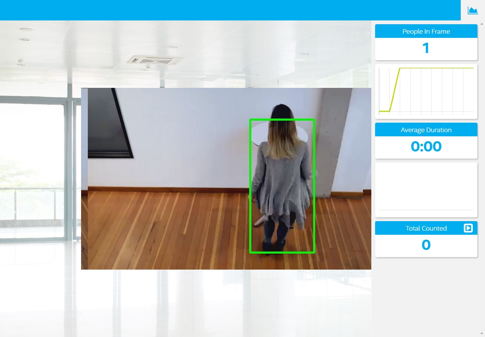

# Project Write-Up

The people counter application demonstrates how to create a smart video IoT solution using Intel® hardware and software tools. The app will detect people in a designated area, providing the number of people in the frame, average duration of people in frame, and total count. This project is a part of Intel Edge AI for IOT Developers Nanodegree program by udacity.



## Explaining Custom Layers
TensorFlow use CoCo dataset to train many object detection models such as Ssd_inception_v2_coco and faster_rcnn_inception_v2_coco. Both performed well as compared to the rest of the model. We will use faster_rcnn_inception_v2_coco in this project to better address our requirements. faster_rcnn_inception_v2_coco is fast in detecting people with less errors. All layers in the model are not supported, but Intel openVINO already contains extensions for custom layers used in TensorFlow Object Detection Model Zoo.

Downloading the model from the GitHub repository of Tensorflow Object Detection Model Zoo by the following command:

```
wget http://download.tensorflow.org/models/object_detection/faster_rcnn_inception_v2_coco_2018_01_28.tar.gz
```
Extracting the tar.gz file by the following command:

```
tar -xvf faster_rcnn_inception_v2_coco_2018_01_28.tar.gz
```
Changing the directory to the extracted folder of the downloaded model:

```
cd faster_rcnn_inception_v2_coco_2018_01_28
```
The model can't be the existing models provided by Intel. So, converting the TensorFlow model to Intermediate Representation (IR) or OpenVINO IR format. The command used is given below:

```
python /opt/intel/openvino/deployment_tools/model_optimizer/mo.py --input_model faster_rcnn_inception_v2_coco_2018_01_28/frozen_inference_graph.pb --tensorflow_object_detection_api_pipeline_config pipeline.config --reverse_input_channels --tensorflow_use_custom_operations_config /opt/intel/openvino/deployment_tools/model_optimizer/extensions/front/tf/faster_rcnn_support.json
```
## Comparing Model Performance

My method(s) to compare models before and after conversion to Intermediate Representations
were : 
### Converted the model to intermediate representation using the appropriate command.
    - Ssd_inception_v2_coco_2018_01_28
    ```
      python /opt/intel/openvino/deployment_tools/model_optimizer/mo.py --input_model ssd_inception_v2_coco_2018_01_28/frozen_inference_graph.pb --tensorflow_object_detection_api_pipeline_config pipeline.config --reverse_input_channels --tensorflow_use_custom_operations_config /opt/intel/openvino/deployment_tools/model_optimizer/extensions/front/tf/ssd_v2_support.json
    ```

    - Faster_rcnn_inception_v2_coco_2018_01_28
    ```
    python /opt/intel/openvino/deployment_tools/model_optimizer/mo.py --input_model faster_rcnn_inception_v2_coco_2018_01_28/frozen_inference_graph.pb --tensorflow_object_detection_api_pipeline_config pipeline.config --reverse_input_channels --tensorflow_use_custom_operations_config /opt/intel/openvino/deployment_tools/model_optimizer/extensions/front/tf/faster_rcnn_support.json
    ```
### Comparison
  The difference between model accuracy & size and time are sommarize below 

    | Model/Framework                             | Latency (microseconds)            | Memory (Mb) |
    | -----------------------------------         |:---------------------------------:| -------:|
    | ssd_inception_v2_coco (pre)                 | 222                               | 538    |
    | ssd_inception_v2_coco (post)                | 155                               | 329    |
    | faster_rcnn_inception_v2_coco (pre)         | 1281                              | 562    |
    | faster_rcnn_inception_v2_coco (post)        | 889                               | 281    |

## Assess Model Use Cases

1. In this period of covid-19 crisis, this application can be useful to limit the number of people in a public space such as at the reception in a company or in waiting rooms.
2. Another case may be control in a herd: knowing at all times the number of animals, studying their behavior, the number of times each puts in front of the feeder for example can help to know which food they like to eat the most.
3. Know the time taken by a customer to decide to buy a particular product. An example: a client who takes more time to decide is either in the car of choice or is not confident.


## Assess Effects on End User Needs

Several ideas can be drawn on the model by testing it with different videos and according to needs and by analyzing the performance of the model on low light videos.


